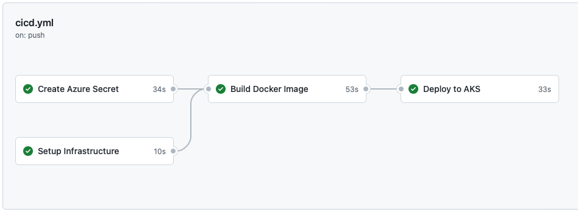

[](https://github.com/goseind/schablone/actions/workflows/cicd.yml)

# Schablone 📃

**Schablone** 📃 is a full-stack technology template for apps deployed under [Site Reliability Engineering (SRE)](https://sre.google/sre-book/part-II-principles/) principles and includes the following tools and services:

* [Azure Kubernetes Service (AKS)](https://docs.microsoft.com/en-us/azure/aks/intro-kubernetes)
* [Azure Container Registry (ACR)](https://docs.microsoft.com/en-us/azure/container-registry/container-registry-intro)
* [Terraform (Infrastructure as Code)](https://www.terraform.io/intro)
* [Docker](https://docs.docker.com/get-started/overview/)
* [GitHub Actions](https://docs.github.com/en/actions)
* Flask & Redis for the example service app (from [Azure-Samples](https://github.com/Azure-Samples/azure-voting-app-redis))

## Setup Instructions

1. Log in or sign up for [Azure](https://azure.microsoft.com) with free credit and install the [Azure CLI](https://docs.microsoft.com/en-us/cli/azure/install-azure-cli) on your system (e. g. `brew update && brew install azure-cli`)
2. Install the [Terraform CLI](https://learn.hashicorp.com/tutorials/terraform/install-cli) `brew update && brew tap hashicorp/tap` and `brew install hashicorp/tap/terraform`
3. Run `az login` and follow the instructions
4. Use this repository as a template: https://github.com/goseind/schablone/generate
5. Create a service principal and store the JSON object output in a GutHub Actions secret called `AZURE_CREDENTIALS`
   
   ```bash
   az ad sp create-for-rbac --name "myApp" --role contributor \
                            --scopes /subscriptions/{subscription-id}/resourceGroups/{resource-group} \
                            --sdk-auth
   ```

6. [Create an Active Directory service principal account](https://learn.hashicorp.com/tutorials/terraform/aks#create-an-active-directory-service-principal-account) `az ad sp create-for-rbac --skip-assignment` and copy the values locally to use in the next step
7. Navigate to `cd infrastructure/terraform` and run `terrafrom init` and then `terraform apply -var="appId=<your appId>" -var="password=<your password>"` with your credentials to provision the AKS cluster
8. Add the AKS cluster to `kubectl` `az aks get-credentials --resource-group <rg-name> --name <aks-name>`
9. [Create a Azure Container Registry](https://docs.microsoft.com/de-de/azure/container-registry/container-registry-get-started-azure-cli) `az acr create --resource-group <rg-name> --name <acr-name> --sku Basic` and copy the `loginServer` URL
10. Add the ACR to AKS `az aks update -n myAKSCluster -g <rg-name> --attach-acr <acr-name>`
11. Adjust the values in the [CI/CD workflow](.github/workflows/cicd.yml):
   
   ```yml
   AZURE_CONTAINER_REGISTRY: "your-azure-container-registry"
   CONTAINER_NAME: "your-container-name"
   RESOURCE_GROUP: "your-resource-group"
   CLUSTER_NAME: "your-cluster-name"
   DEPLOYMENT_MANIFEST_PATH: 'infrastructure/kubernetes/azure-vote-all-in-one-redis.yaml'
   ```

12. Run CI/CD to deploy the example service in [azure-vote-all-in-one-redis](infrastructure/kubernetes/azure-vote-all-in-one-redis.yaml)
13. Run `kubectl get service azure-vote-front --watch` to get the public IP and open it in the browser and `kubectl get pods` to see id the pods are running

### CI/CD Workflow

Every time you push code changes to Terraform, Kubernetes or Dockerfile the CI/CD workflow executes and deploys the new version into the AKS cluster:

```yml
on:
  push:
    paths:
      - 'Dockerfile'
      - '**.tf'
      - 'infrastructure/kubernetes/**'
```

As you can see the jobs in the workflow depend on each other, the infrastructure gets provisioned first via Terraform, then the Docker image and lastly the Kubernetes deployment.

